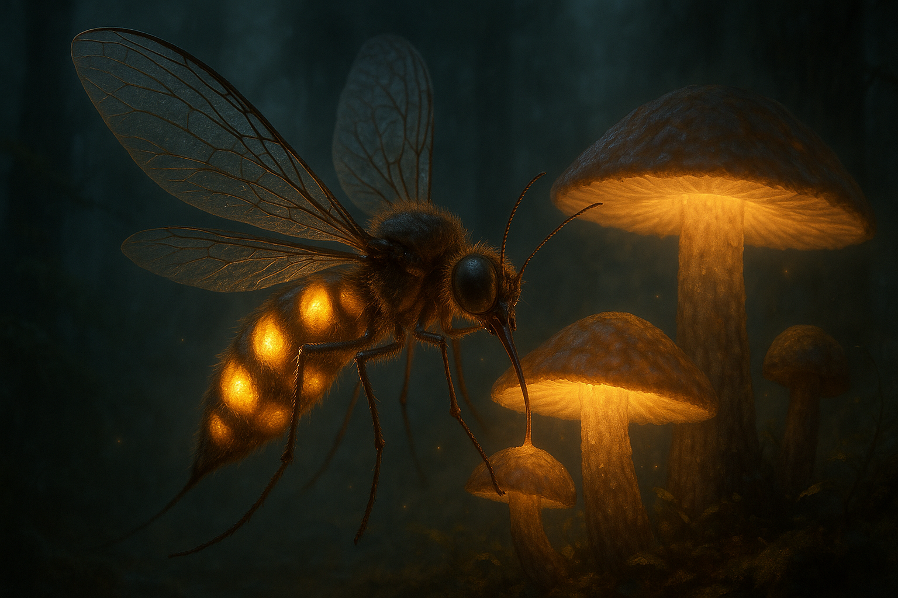
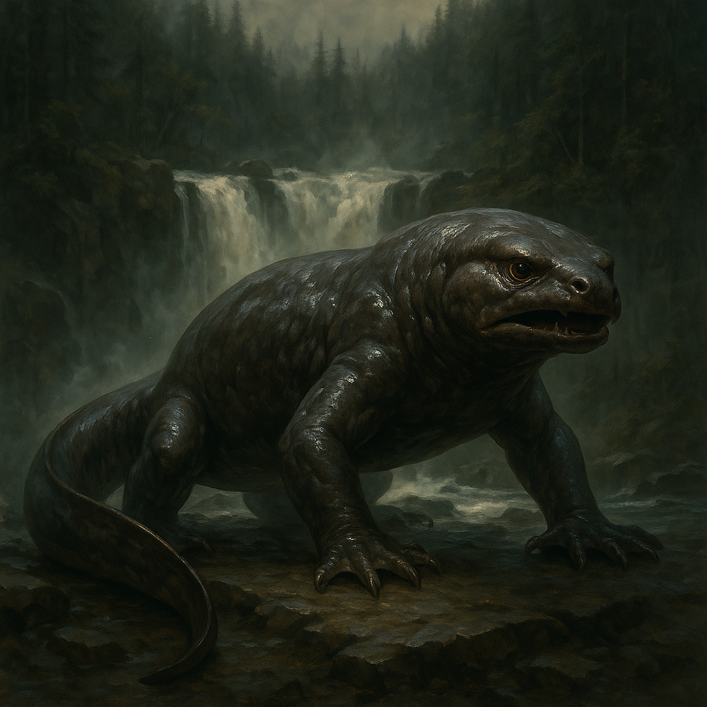
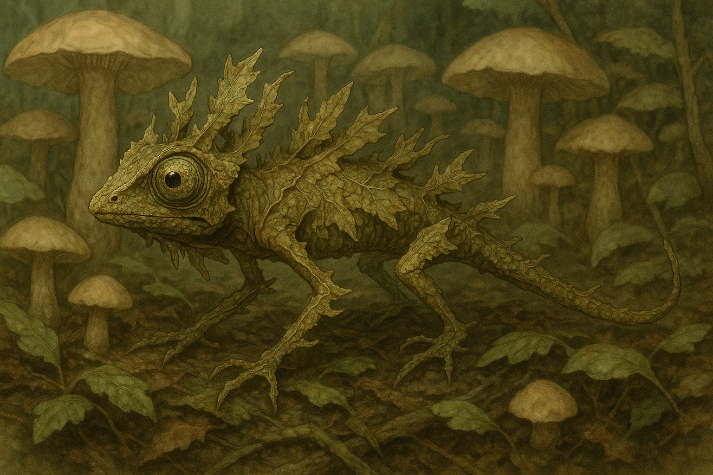
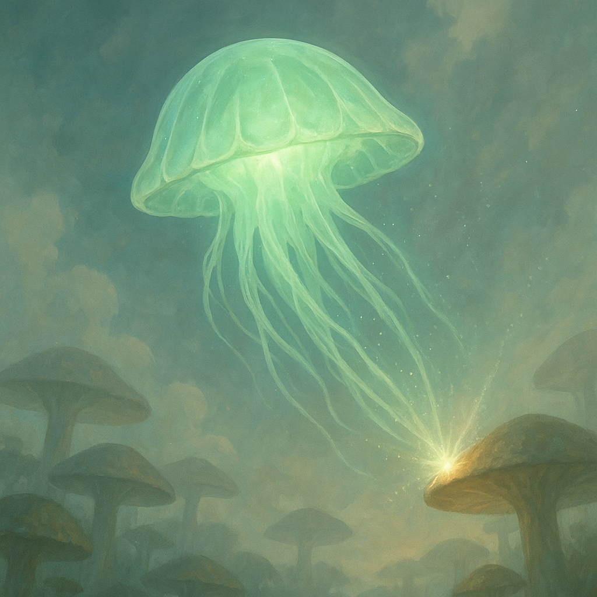

<link rel="stylesheet" href="../css/conceptart.css">

# Mykoria

Mykoria to gęsto zalesiona, mistyczna kraina rozciągająca się na północ od Kerschal’Worr. Jest to miejsce, gdzie natura splata się z pradawną magią, a granice między rzeczywistością a światem duchów bywają niezwykle cienkie.

## Początki Mykorii

Mykoria powstała wskutek uderzenia obiektu z kosmosu. Na jej miejscu niegdyś rozciągał się humanoidalny las o nazwie **[wstaw nazwę]**. Kilka wieków temu, zgodnie z legendami, potężny obiekt spadł na środek tego lasu, wyjałowując teren i obniżając go znacznie poniżej pierwotnego poziomu.

W wyniku uderzenia powstała ogromna kotlina, której brzegi wyznaczają nieprzebytych wodospadów otaczających Mykorię. Kraina ta jest przez to odizolowana, a jej granice tworzą naturalną barierę — wodospady opadające w przepaść, które nie pozwalają na swobodne przejście.

## Flora
Po uderzeniu obiektu w krainę pojawiło się wiele gatunków grzybów, różnej wielkości — od drobnych zarodników po gigantyczne kapelusze. Niektóre z nich mają tajemnicze, niezbadane właściwości.

Roślinność Mykorii jest znacznie większa niż w dawnym Humanoidalnym Lesie. Wzrost roślin zwiększył się od 30% do nawet 250% w porównaniu do pierwotnych rozmiarów.

---

### 1. Mykrost

  
  
Mykrost to drobny, niemal eteryczny pył unoszący się w powietrzu Mykorii, powstały w wyniku uderzenia kosmicznego obiektu. Składa się z mikroskopijnych cząstek grzybni i minerałów o świetlistych właściwościach. Pył ten przenika cały ekosystem, oddziałując na rośliny i zwierzęta, powodując niezwykłe mutacje i przyspieszając ewolucję.

Osoby, które nigdy wcześniej nie miały kontaktu z Mykrostem, doświadczają silnej wysypki i podrażnień skóry przy pierwszym zetknięciu. Z każdym kolejnym kontaktem reakcje organizmu słabną, a skóra stopniowo przyzwyczaja się do pyłu. Jednak niektóre jednostki wykazują wyjątkowo silną nadwrażliwość — rozwijają u nich objawy przypominające przewlekłe stany zapalne, prowadzące do zmęczenia, bólu mięśni, gorączki i powiększenia węzłów chłonnych, co w ekstremalnych przypadkach uniemożliwia dłuższe przebywanie na terenie Mykorii.

### 2. Zefyrlia

  
  
Rosnąca w skupiskach pośród dolinnych mgieł Zefyrlia przypomina zmutowaną mieszaninę wiciokrzewu, dmuchawca i meduzy. Jej długie pędy zakończone są półprzezroczystymi pęcherzami, które unoszą się lekko nad ziemią dzięki lekkim gazom. Gaz powstaje jako efekt fermentacji soków Mykrostowych, które Zefyrlia wchłania przez korzenie. Pęcherze świecą ciepłym, bursztynowym światłem – nocą tworząc świetliste połacie przypominające odwrócone niebo. Gdy dotknięta, eksploduje cicho, rozrzucając lepką, żarzącą się mgiełkę. Wysuszone łodygi są zbierane przez mieszkańców Mykorii jako źródło ognia. Uważa się, że Zefyrlia to jedna z pierwszych roślin, które „nauczyły się żyć z Mykrostem”.

### 3. Cryolam

  
  
Gęsty, matowy porost przypominający połączenie mchu z rafą koralową. Rośnie w cieniu wielkich grzybów, gdzie wilgoć i cień sprzyjają jego rozrostowi. Jego powierzchnia pokryta jest srebrzystymi włoskami, przez co wygląda jak oszroniona nawet w cieplejszych porach. Mirglot absorbuje Mykrost i przekształca go w chłodzący biokondensat, który powoli odparowuje, obniżając lokalnie temperaturę nawet o kilka stopni. Gdy dotknięty nagle, reaguje sykiem i nagłym skurczeniem — jakby się bał. Co ciekawe, zwierzęta ranne lub przegrzane często kładą się na nim, by odzyskać siły. Zielarze Mykorii wykorzystują go do tworzenia maści chłodzących i przeciwgorączkowych.

### 4. Mycospira

  
  
Wysoka, chwiejąca się grzybnia, osiągająca nawet 3 metry, zbudowana z cienkich trzonów zakończonych półprzezroczystymi kapeluszami przypominającymi bańki mydlane. Kapelusze te pulsują w rytmie niewidzialnego wiatru, a czasem zdają się "oddychać". Roślina reaguje na fale dźwiękowe – głośniejsze dźwięki lub śpiew wywołują jej nagłą reakcję: trzon wypręża się, a kapelusz otwiera, wyrzucając zarodniki w powietrze. Zarodniki mają właściwości neuroaktywne – powodują krótkotrwałe halucynacje, euforię lub stany przypominające sen. Dla nieprzyzwyczajonych — mogą być paraliżujące. Bywa stosowana ceremonialnie przez klany żyjące głęboko w Mykorii.

### 5. Fibroven

  
  
Splątana, pajęczynowata roślina przypominająca jednocześnie liany i sieć pajęczą. Zwisa z wysokich grzybodrzew, tworząc mgiełkę włókien. Są one lepkie i półprzezroczyste, a przy poruszeniu drżą, wydając dźwięk przypominający tkanie nici. Niektóre zwierzęta używają jej do budowy gniazd. Lianasis rośnie tylko tam, gdzie powietrze jest przesycone Mykrostem. Inspiracja: pajęczyny, tilandsje, wiciokrzew, pnącza tropikalne.

## Fauna

### 1. Luminryl

  
  
Stworzenie o długości około 1 metra, będące połączeniem cech komara, trzmiela i świetlika. Jego półprzezroczyste skrzydła szeleszczą cicho podczas lotu. Żywi się sokami wielkich grzybów Mykorii, które dzięki temu wpływają na intensywność i barwę emitowanego przez niego światła — świeci mocniej i żywiej niż jakikolwiek inny organizm w krainie. Emitowane światło służy zarówno wabieniu drobnych owadów, jak i komunikacji w gęstej, mglisto-pyłowej atmosferze.

### 2. Hydrathal

  
  
Stworzenie o budowie łączącej cechy salamandry i wydry, zamieszkujące głównie okolice wodospadów otaczających Mykorię. Ma gładką, śliską, lecz grubą skórę odporną na ciągłą wilgoć i kontakt z toksycznym pyłem Mykrostu. Jest terytorialna i agresywna, broni dostępu do wodospadów, które stanowią naturalne granice krainy. Salamandra wodospadowa uniemożliwia opuszczenie Mykorii niepowołanym, patrolując brzegi i atakując intruzów.

### 3. Syzmarin

  
  
Niewielkie stworzenie o długości około 40 cm, łączące cechy kameleona i patyczaka z liśćmi. Potrafi perfekcyjnie zmieniać kolor i fakturę skóry, upodabniając się do liści, gałęzi i grzybowych kapeluszy. Ma wydłużone ciało i cienkie odnóża, dzięki którym przypomina suchy liść poruszany wiatrem. Ta kamuflażowa zdolność pozwala mu przetrwać w gęstym, grzybowym lesie i unikać drapieżników.

### 4. Mykareon

  
  
Latający organizm o kształcie przypominającym meduzę, którego parasolowaty, przezroczysty kapelusz delikatnie świeci bladozielonym światłem. Porusza się po niebie Mykorii, unosząc się na ciepłych prądach powietrza. Gdy zetknie się z innym grzybem lub podobnym organizmem, nagle zyskuje impuls energii, odbija się i przyspiesza lot, rozsiewając wokół siebie pył Mykrostu, który wpływa na dalsze przemiany środowiska. Jest symbolem i czynnikiem ciągłej ewolucji ekosystemu Mykorii.

[⬅️ Wróć do spisu treści](../index.md)
